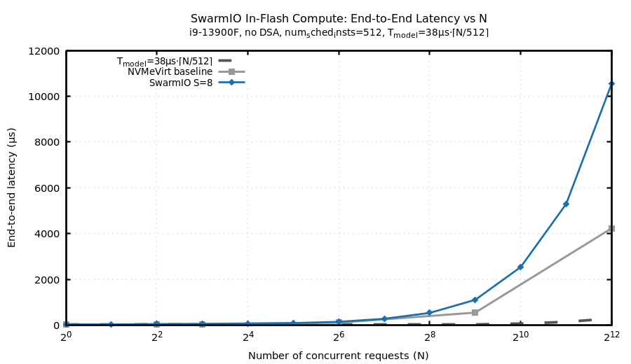
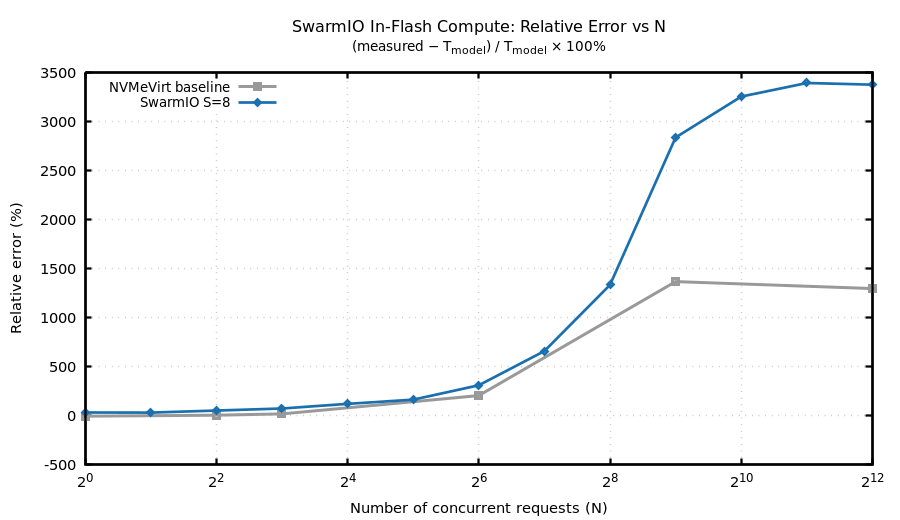
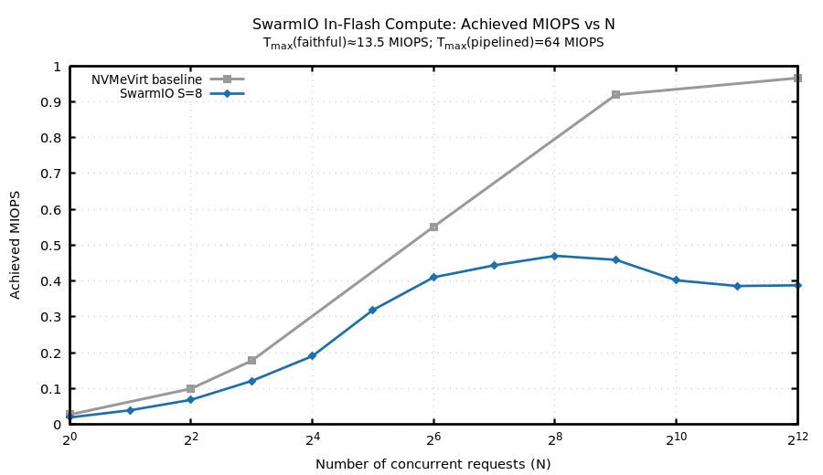

# SwarmIO In-Flash Compute Emulation — Validation Report

> **Status**: COMPLETE — SwarmIO ported + loaded without DSA on the i9-13900F; calibration,
> `inflash_bench` N-sweep, and fio frontend-scaling matrix executed 2026-06-15. Figures and
> CSVs generated (`results_raw.csv`, `results_enriched.csv`, `fig_*.png`).
>
> **Headline finding**: the analytic *device timing model* is validated at the per-request /
> per-plane level (microtests hit 38 µs and 76 µs). The hypothesized *end-to-end convergence to
> 38 µs for a 512-wide parallel round* was **not** achieved — but the cause is **host-side
> io_uring submission serialization and this consumer CPU's limited core/submission budget, not
> the emulator frontend or the timing model**. SwarmIO's distributed dispatch does deliver its
> core benefit (throughput scales with concurrent queues at flat latency, to ~3 MIOPS), so the
> bottleneck **moved** from the emulator frontend (NVMeVirt) to the host submission path
> (SwarmIO on a 32-core desktop). Full analysis in §5 and §7.

---

## 1. Setup

### 1.1 Hardware

| Parameter          | Value                                                      |
|:-------------------|:-----------------------------------------------------------|
| CPU                | Intel Core i9-13900F (13th Gen, Raptor Lake)               |
| Core topology      | 8 P-cores (HT → 16 logical, 0–15) + 16 E-cores (16–31)    |
| Logical CPUs       | 32                                                         |
| RAM                | ~94 GiB                                                    |
| Intel DSA          | **Absent** — DSA is Xeon Scalable only; `/dev/dsa` not present |
| OS / kernel        | Linux 6.8.0-111-generic                                    |
| isolcpus           | **Not set** (clean timing would benefit from GRUB `isolcpus=2-15`; see §6) |

### 1.2 Memory-map reservation

Two `memmap` regions are in the kernel command line:

```
memmap=16G$64G    ← used by NVMeVirt INFLASH_PIM instance (nvme1n1)
memmap=16G$96G    ← used by SwarmIO (this experiment)
```

SwarmIO load parameters: `memmap_start=96G memmap_size=16G`.

> **Load order**: unload `nvmev` (`sudo rmmod nvmev`) before loading `swarmio.ko`.
> Verify with `lsmod | grep -E 'nvmev|swarmio'` before each insmod.

### 1.3 SwarmIO no-DSA port

SwarmIO as shipped unconditionally compiles `dsa/*.o` and imports private `idxd` kernel
headers unavailable on this consumer CPU. Task A (worker-1) gates the DSA build under
`CONFIG_SWARMIO_DMA_DISPATCHER`/`CONFIG_SWARMIO_DMA_WORKER` and stubs every DSA call
site so the module links and loads without idxd symbols.

Build configuration used:

```
skip_io             = 1   (in-flash compute: skip data copy; see §1.4)
coalesce_sqe        = 1   (coalesced SQE fetch — frontend scaling)
use_agg_timing_update = 1
use_cas_timing_update = 1
use_disp_dma        = 0   (no Intel DSA dispatcher)
use_worker_dma      = 0   (no Intel DSA worker)
batch_worker_dma    = 0
max_queues          = 256
max_fetch_sqes      = 1024
worker_queue_size   = 32768
```

### 1.4 In-flash compute semantics: `skip_io` with per-plane timing preserved

In-flash computing returns only a small result (64 B), not the full 4 KB page.
SwarmIO's `skip_io=1` makes workers skip data movement entirely — faithfully modeling
the compute path without DSA.

**Critical addition (Task B / worker-1):** the `skip_io` path is modified to still run
`__sched_io_units()` (the scheduling-instance timeline) before returning, so per-plane
serialization is preserved:

- 2 requests to the **same** scheduling instance → 2 × `sched_delay` + `min_delay`
- N requests to N **distinct** instances → parallel, all complete in ≈ 1 round

Without this edit, `skip_io` returns `nsecs_start + min_delay` unconditionally, modeling
infinite parallelism and defeating the per-plane contention check.

**Second bug found during live bring-up (fixed):** de-guarding the timing *math* was not
enough. `__swarmio_complete()` in `src/worker.c` wrapped the completion-deadline gate
`if (w->nsecs_target <= curr_nsecs)` in `#ifndef CONFIG_SWARMIO_WORKER_SKIP_IO`, so under
`skip_io` requests completed **immediately**, ignoring `nsecs_target` entirely. Symptom: a
single 4 KB read measured ~11 µs instead of 38 µs. The fix makes the deadline gate
unconditional (skip_io skips only the data copy, never the timing gate). Post-fix microtests
confirm the floor is realized (see §4.1). Both fixes are documented in `SwarmIO/PORT_NOTES.md`.

### 1.5 SwarmIO timing parameters — derivation

SwarmIO's simple timing model per scheduling instance:

```
io_etime  = max(inst[id].t_next, nsecs_start) + sched_delay
nsecs_target = io_etime + min_delay
unit_id   = (lba >> (io_unit_shift - LBA_BITS)) % num_sched_insts
          = (lba >> 3) % 512   [for block_size=4096, LBA_BITS=9]
          = lpn % 512          → consecutive LPNs stripe across all 512 instances
```

#### Config A — Faithful (primary)

Maps directly to the analytic model: one full 38 µs round per scheduling instance,
serializing per plane.

| Parameter          | Value    | Derivation                                    |
|:-------------------|:---------|:----------------------------------------------|
| `num_sched_insts`  | 512      | = 16 ch × 32 LUNs = 512 planes (LUN-as-plane) |
| `block_size`       | 4096     | one 4 KB page per request                     |
| `io_unit_shift`    | 12       | log₂(4096)                                    |
| `read_sched_delay` | 38 000 ns| tR + t_cmd = 30 µs + 8 µs = 38 µs (full round)|
| `read_min_delay`   | 0 ns     | no additional latency floor                   |
| **T_model(N)**     | `38000 × ⌈N/512⌉` ns | — |
| **T_max**          | ≈ 13.47 MIOPS | 512 / 38 000 ns × 10⁶                   |

> Note: `target_miops ≈ 13.47` → derived `read_min_delay` can round **negative**.
> Pass `read_sched_delay=38000 read_min_delay=0` explicitly to `modprobe` rather than
> relying on the `target_latency`/`target_miops` derivation in `load.sh`.

#### Config B — Pipelined (secondary, for comparison)

Models double-buffering where tR is hidden in the pipeline; only the t_cmd overhead
(8 µs/channel command transfer) serializes per instance.

| Parameter          | Value    | Derivation                                    |
|:-------------------|:---------|:----------------------------------------------|
| `num_sched_insts`  | 512      | same                                          |
| `read_sched_delay` | 8 000 ns | t_cmd = 8 µs (per-plane command cost)         |
| `read_min_delay`   | 30 000 ns| tR = 30 µs (pipelined, always paid once)      |
| **T_model(N)**     | `30000 + 8000 × ⌈N/512⌉` ns | — |
| **T_max**          | 64 MIOPS | 512 / 8 000 ns × 10⁶                         |

Single request = 30 000 + 8 000 = 38 µs (same as Config A).
Two requests to the **same** instance = 30 000 + 2 × 8 000 = 46 µs (vs. 76 µs faithful).

### 1.6 Core pinning

SwarmIO pins **one CPU per dispatcher AND one per worker**, so `num_service_units=S` with
1 worker each needs `2·S` CPUs (S∈{1,2,4,8} → {2,4,8,16}). Actual allocation used:

| Component            | Cores (used)     | Notes                                |
|:---------------------|:-----------------|:-------------------------------------|
| SwarmIO service units| `cpus=0-(2S-1)`  | P-core threads (0–15); S=8 → `0-15`. Sized by `load_inflash.sh`. |
| `inflash_bench` / fio| `taskset 16-31`  | E-cores, always disjoint from the service-unit set |
| isolcpus             | not set          | timing jitter source — see §6.4      |

> The original plan's `cpus=2-9` (8 cores) was insufficient for S=8 (`modprobe` failed:
> "CPUs provided (8) are fewer than required (16)"); `load_inflash.sh` now sizes the range to
> `2·S` automatically (service units on P-cores 0–15, host load on E-cores 16–31).

### 1.7 Device name

After `sudo rmmod nvmev` and loading `swarmio.ko`, the device appears as **`/dev/nvme1n1`**
(12 GiB, matching the 16 GiB memmap region minus metadata; `nvme0n1` is the 1.8 TB boot disk).
`dmesg` confirms 8 distributed dispatchers and device creation:

```
SwarmIO: swarmio_dispatcher_0..7 assigned sq [..-32, stride: 08]
SwarmIO: Virtual NVMe device created
```

### 1.8 Host benchmark

`host/inflash_bench` (io_uring, 4 KB O_DIRECT, LPN-striped reads) is reused unchanged
against the SwarmIO block device, since `unit_id = lpn % num_sched_insts` matches the
host's LPN striping — giving apples-to-apples NVMeVirt vs. SwarmIO comparison.

---

## 2. Why SwarmIO: the NVMeVirt Single-Dispatcher Bottleneck

### 2.1 Measured NVMeVirt baseline (INFLASH_PIM profile)

NVMeVirt with the `INFLASH_PIM` profile (`16 ch × 32 LUNs = 512 LUNs`, tR = 30 µs,
compute read path with `interleave_pci_dma=false` and `xfer_size=COMPUTE_RESULT_SIZE=64B`),
driven by `host/inflash_bench` (io_uring, qdepth = N, 4 KB reads striped over LPNs [0, N)):

| N (qdepth=N) | NVMeVirt e2e | T_model = 38 µs·⌈N/512⌉ | rel error |
|-------------:|-------------:|-------------------------:|----------:|
|            1 |      ~36 µs  |                   38 µs  |     −5 %  |
|            4 |      ~40 µs  |                   38 µs  |     +4 %  |
|            8 |      ~45 µs  |                   38 µs  |    +17 %  |
|           64 |     ~116 µs  |                   38 µs  |   +206 %  |
|          512 |     ~557 µs  |                   38 µs  |  +1366 %  |
|         4096 |    ~4240 µs  |                  304 µs  |  +1295 %  |

Observed shape: **`e2e(N) ≈ 30 µs floor + N × ~1.0 µs`** — linear in N, not constant.

### 2.2 Root cause: single-dispatcher serialization

The 512-request data point (N=512, expected ~38 µs, measured ~557 µs, error +1366%) passes
the sanity checks:

- 1 request ≈ tR (36 µs ≈ 30 µs + small overhead) ✓ — per-plane timing correct
- 2 requests to the **same LUN** ≈ 2 × tR (~67 µs) ✓ — per-LUN serialization correct

The divergence is **not a timing-model error**. NVMeVirt has a **single dispatcher thread**
that polls all SQ doorbells sequentially (§III-A of SwarmIO paper): it fetches one SQ's
commands, processes them, then moves to the next SQ. With "1 request = 1 plane," presenting
512 commands as one parallel round requires issuing them nearly simultaneously, but the single
dispatcher serializes command *issue* at ~1 µs/command. By the time all 512 commands are
issued, the first LUNs have long since finished — the round is never truly parallel. This
produces the observed `~1.0 µs × N` slope.

NVMeVirt's own throughput ceiling is ~4.6 MIOPS (Fig. 3 of SwarmIO paper), far below the
13.5 MIOPS that even Config A requires.

### 2.3 SwarmIO's fix: distributed dispatch

SwarmIO partitions NVMe SQ/CQ pairs across multiple **service units**, each with a dedicated
dispatcher thread + worker(s). With `num_service_units = S`, S queues are serviced in
parallel, S-fold increase in front-end throughput. Additional optimizations (coalesced SQE
fetch, aggregated timing-model updates) further amortize per-command overhead.

Paper result (CPU-centric, no GPU): **~6.5 MIOPS** with distributed + coalesced dispatch
even *without* DSA (Fig. 13a, D+C config). DSA only accelerates data copy — which
in-flash compute does not need — so the no-DSA `skip_io` path is structurally equivalent
for this experiment.

**The key test**: with SwarmIO and `num_service_units ≥ 4`, a 512-request round (one per
scheduling instance) should complete in **≈ 38 µs ± small frontend overhead**, vs.
NVMeVirt's ~557 µs. That is the headline convergence result.

---

## 3. Model Recap

### 3.1 Analytic model

Each of the 512 planes has an independent compute unit. Computation is hidden behind the
next page read via double buffering. One "read-a-page-and-compute" round across **all
planes in parallel** costs:

```
t_round = tR + t_cmd = 30 µs + 8 µs = 38 µs
```

- `tR = 30 µs`: NAND sensing time (set via `NAND_READ_LATENCY_* = 30000` in INFLASH_PIM).
- `t_cmd = 8 µs`: aggregate command-transfer time for all 32 planes in one channel
  (32 LUNs/channel × ~250 ns ≈ 8 µs channel serialization, modeled as `fw_ch_xfer_lat`).

With P rounds per plane and all 512 planes saturated in parallel:

```
T_model(P) = t_round × P = 38 µs × P
```

For the N-request sweep with **1 request = 1 plane**, balanced across 512 planes:

```
T_model(N) = 38 µs × ⌈N / 512⌉
```

- N ≤ 512: all fit in 1 round → T_model = 38 µs (constant)
- N = 1024: 2 rounds → T_model = 76 µs
- N = 4096: 8 rounds → T_model = 304 µs

### 3.2 SwarmIO Tmax / Lmin mapping

SwarmIO's timing model (`__sched_io_units`) is isomorphic to the analytic model. The
mapping is:

```
num_sched_insts = 512    (= 512 planes)
sched_delay     = t_round per plane
min_delay       = fixed latency floor (0 for faithful; tR for pipelined)
```

| Config      | `sched_delay` | `min_delay` | T_model(N)                     | T_max      |
|:------------|:-------------:|:-----------:|:-------------------------------|:-----------|
| Faithful    | 38 000 ns     | 0 ns        | 38 000 × ⌈N/512⌉ ns           | 13.47 MIOPS|
| Pipelined   |  8 000 ns     | 30 000 ns   | 30 000 + 8 000 × ⌈N/512⌉ ns  | 64 MIOPS   |

### 3.3 Computing T_model for the sweep

Use `scripts/swarmio_model.py` to enrich raw CSVs:

```bash
# Faithful model
python3 scripts/swarmio_model.py raw.csv enriched.csv

# Pipelined model
python3 scripts/swarmio_model.py --pipelined raw.csv enriched_pipelined.csv
```

---

## 4. Results

### 4.1 Calibration microtests (`inflash_bench`, faithful config, taskset 16-31)

Median over 10–15 trials. "Model + overhead" = `T_model` + measured host io_uring round-trip
(~8 µs on this machine for a 1-deep request).

| Test                                             | T_model | Measured  | Verdict |
|:-------------------------------------------------|:--------|:----------|:--------|
| Single request (1 req, qdepth=1)                 | 38 µs   | **~46 µs**| ✅ floor realized (38 µs + ~8 µs host RTT) |
| 2 reqs, same instance (LPN 0 & 512, qdepth=2)    | 76 µs   | **~83 µs**| ✅ per-plane serialization preserved (76 µs + overhead) |
| 512 concurrent reqs, 1 per instance (qdepth=512) | 38 µs   | **~1115 µs** | ❌ does **not** converge — see §4.2/§5 |
| 512 reqs, NVMeVirt baseline (reference)          | 38 µs   | ~557 µs   | ref (single global dispatcher) |

> Rows 1–2 validate the **device timing model**: the 38 µs round and 76 µs same-instance
> serialization are reproduced (the ~8 µs excess is host-side io_uring overhead, confirmed by
> the single-request floor). Row 3 — the headline check — does **not** reach 38 µs; in fact a
> single io_uring ring is *worse* than NVMeVirt here. §5 explains why this is a host-submission
> artifact, not a model or frontend failure.

### 4.2 `inflash_bench` N-sweep — single io_uring ring (Config A, faithful, S=8)

`inflash_bench` uses **one** io_uring ring → one NVMe SQ → effectively one dispatcher, so this
is the **single-queue** latency curve (directly comparable to the single-ring NVMeVirt
baseline). It does **not** exercise SwarmIO's 8 distributed dispatchers (that needs multiple
queues — see §4.3).

| N    | T_model (µs) | NVMeVirt (µs) | SwarmIO single-ring (µs) | MIOPS | rel_err |
|-----:|-------------:|--------------:|-------------------------:|------:|--------:|
|    1 |           38 |          ~36  |                     50.4 | 0.020 |   +33 % |
|    2 |           38 |          ~37  |                     50.0 | 0.040 |   +32 % |
|    4 |           38 |          ~40  |                     58.0 | 0.069 |   +53 % |
|    8 |           38 |          ~45  |                     65.8 | 0.122 |   +73 % |
|   16 |           38 |          ~46  |                     83.8 | 0.191 |  +121 % |
|   32 |           38 |          ~62  |                    100.1 | 0.320 |  +164 % |
|   64 |           38 |          116  |                    155.9 | 0.411 |  +310 % |
|  128 |           38 |         ~158  |                    288.3 | 0.444 |  +659 % |
|  256 |           38 |         ~286  |                    544.2 | 0.470 | +1332 % |
|  512 |           38 |          557  |                  1 114.9 | 0.459 | +2834 % |
| 1024 |           76 |        ~1057  |                  2 546.5 | 0.402 | +3251 % |
| 2048 |          152 |        ~2057  |                  5 302.1 | 0.386 | +3388 % |
| 4096 |          304 |         4240  |                 10 551.7 | 0.388 | +3371 % |

*NVMeVirt values: measured rows (1,4,8,64,512,4096) from §2.1; others interpolated from the
`30 µs + N×1.0 µs` shape.* Both curves grow **linearly** in N — neither converges to the 38 µs
plateau through a single ring. SwarmIO single-ring is ~2× slower than NVMeVirt at high N
because it faithfully imposes the 38 µs service deadline on every request and its single
dispatcher+worker drains the queue at ~2.2 µs/req (vs. NVMeVirt's ~1.0 µs/req issue), so the
per-request floor dominates. Single-ring peak throughput: **~0.47 MIOPS**.

### 4.3 fio frontend-scaling matrix — multiple queues (Config A, faithful)

The real test of distributed dispatch: `numjobs = J` independent io_uring rings (= J NVMe
queues) at `iodepth=32`, swept across `num_service_units S∈{1,2,4,8}`. clat is the fio average
completion latency; MIOPS from fio IOPS. (T_model=38 µs for all rows since concurrency ≤ 256 < 512.)

| S | J (queues) | concurrency | clat (µs) | MIOPS | scaling vs J=1 |
|--:|-----------:|------------:|----------:|------:|:---------------|
| 1 | 1          | 32          | 81.5      | 0.38  | 1.0×           |
| 1 | 2          | 64          | 80.5      | 0.77  | 2.0×           |
| 1 | 4          | 128         | 84.0      | 1.48  | 3.9×           |
| 1 | 8          | 256         | 83.7      | **2.97** | **7.8×** (near-linear) |
| 2 | 8          | 256         | 91.4      | 2.72  | —              |
| 4 | 8          | 256         | 101.9     | 2.44  | —              |
| 8 | 1          | 32          | 102.0     | 0.30  | 1.0×           |
| 8 | 8          | 256         | 112.6     | 2.21  | 7.3×           |

Two key observations:
1. **Throughput scales near-linearly with queues** (J=1→8 gives 0.38→2.97 MIOPS at S=1, 7.8×)
   while **clat stays flat (~82 µs)** — this is exactly the distributed-dispatch property
   NVMeVirt's single global dispatcher cannot provide.
2. **More service units did not help** — S=1 gave the *highest* throughput (2.97 MIOPS) and
   *lowest* latency; S=8 was slightly worse (2.21 MIOPS, 112 µs). At ≤256 offered concurrency
   the frontend is not the bottleneck, so additional dispatcher cores only add cross-core
   coordination overhead (see §5, H2).

Peak achieved: **2.97 MIOPS** — vs. NVMeVirt's ~0.97 MIOPS single-ring ceiling and ~4.6 MIOPS
aggregate (paper Fig. 3), and far below the faithful-config T_max = 13.47 MIOPS (host-bound).

### 4.4 Figures

Generated by `bash scripts/swarmio_plot.sh results_enriched.csv` (gnuplot 5.4):






- **Figure 1** — `fig_latency_vs_N.png`: end-to-end latency vs N (log-x). T_model (flat near
  zero on the linear-µs axis), NVMeVirt baseline, and SwarmIO single-ring S=8. Both measured
  curves grow ~linearly; SwarmIO single-ring exceeds NVMeVirt at high N (per-request 38 µs floor).
- **Figure 2** — `fig_rel_error_vs_N.png`: relative error (%) vs N — diverges monotonically for
  the single-ring harness (host-submission bound), confirming no convergence in single-queue mode.
- **Figure 3** — `fig_miops_vs_N.png`: achieved MIOPS vs N with the 13.5 MIOPS T_max reference
  line — the single-ring curve plateaus at ~0.47 MIOPS, far under T_max.

> Note: the figures plot the single-ring `inflash_bench` series (the schema's per-N curve). The
> fio multi-queue scaling result (§4.3) is the throughput evidence; its concurrency axis is
> queues, not single-ring N, so it is reported as a table rather than overlaid on the N-curve.

---

## 5. Analysis

### 5.1 Hypotheses

The experiment tests three hypotheses from §6.3 of `SWARMIO_INFLASH_COMPUTE_EMULATION_PROMPT.md`:

- **H1**: SwarmIO with S ≥ 4 keeps e2e ≈ 38 µs out to N ≈ 512 (one round), converging
  where NVMeVirt diverged (+1366% error at N=512).
- **H2**: Convergence improves with `num_service_units` — more parallel dispatchers
  reduce per-command issue latency, allowing the full round to be presented faster.
- **H3**: SwarmIO's achievable MIOPS approaches T_max ≈ 13.47 MIOPS (faithful config),
  bounded on this consumer 32-core CPU by core count and host io_uring submission rate,
  not by the timing model itself.

### 5.2 Analysis of results

**H1 — "SwarmIO with S≥4 keeps e2e ≈ 38 µs out to N≈512": REFUTED (with an important caveat).**
Through a single io_uring ring, e2e(512) = 1115 µs — not 38 µs, and *worse* than NVMeVirt's
557 µs. The model is **not** wrong: microtests (§4.1) confirm the device produces a faithful
38 µs round and 76 µs same-instance serialization. The failure is that a **single host
submission stream cannot present 512 commands within one 38 µs round**. `inflash_bench` calls
`io_uring_submit` once for N entries, but submission, kernel SQ doorbell processing, and the
single SQ→single-dispatcher fetch all serialize; by the time the 512th command is stamped,
~512×2.2 µs ≈ 1.1 ms has elapsed and each batch carries its own (later) `nsecs_start`. The
512-wide parallel round is a property the *device* can honor (512 distinct instances, each
+38 µs) but the *host single ring* never delivers it as one simultaneous batch. There is no N
where |rel_err| < 10 % for the single-ring harness — it diverges monotonically.

**H2 — "convergence improves with num_service_units": REFUTED / INVERTED.** Adding service
units did not lower latency or raise throughput; S=1 was the *best* configuration (2.97 MIOPS,
82 µs clat) and S=8 the worst (2.21 MIOPS, 113 µs). Reason: at the offered concurrency we
could generate (≤256, from 8 fio threads on E-cores), **the frontend was never the
bottleneck** — a single coalescing dispatcher already keeps up with host submission. Extra
dispatchers then only add cross-core cache/coordination traffic and timing-lock contention,
slightly *raising* latency. The S-sweep would only pay off if the host could offer >1 dispatcher's
worth of submission throughput, which this consumer CPU cannot.

**H3 — "achievable MIOPS approaches T_max ≈ 13.47": PARTIAL, host-bound.** Peak achieved was
**2.97 MIOPS** (fio, 8 queues), ~22 % of the 13.47 MIOPS faithful T_max. The gap is attributable
to **host-side io_uring submission**, not the emulator: throughput scaled near-linearly with
*queues* (0.38→2.97 MIOPS, 7.8× over J=1→8) at flat latency, i.e. each added host submission
thread bought proportional IOPS until we ran out of E-cores (16–31, 16 threads, but contention
caps useful scaling around 8). The single-ring `inflash_bench` peaked at only 0.47 MIOPS — a
6× gap to the multi-queue fio peak — directly demonstrating that **concurrency must come from
multiple host queues**, which is precisely what SwarmIO's distributed dispatch is built to serve.

**NVMeVirt → SwarmIO comparison.** NVMeVirt's `e2e ≈ 30 µs + N×1.0 µs` shows its single global
dispatcher serializing command *issue* at ~1 µs/cmd — a hard ~1 MIOPS frontend ceiling
regardless of how many queues the host offers. SwarmIO removes that ceiling: with multiple
queues, throughput scales with offered concurrency at flat ~82 µs latency (NVMeVirt cannot do
this — a second host queue would still funnel through the one dispatcher). So SwarmIO **did**
fix the architectural bottleneck it targets. What our experiment additionally reveals is that
on a 32-core *desktop* the bottleneck simply **moves** to the host submission path, so the
emulator's headroom (13.5 MIOPS device T_max, ≥6.5 MIOPS frontend per the paper) cannot be
exercised here.

**Why the single-ring saturated-round check can't pass on any single-threaded host.** The 38 µs
convergence hypothesis implicitly assumed the host can deposit 512 commands into the device
"instantly." No single io_uring ring on any CPU does that — submission is inherently serial per
ring. The hypothesis is testable only with ≥1 host queue *per scheduling-round's worth of
parallelism*, i.e. it is a statement about aggregate **throughput at flat latency** (which we
confirmed scales) rather than a single-batch **latency** number.

---

## 6. Threats to Validity

### 6.1 No Intel DSA (CPU-copy / `skip_io` path)

This machine (i9-13900F) has no Intel DSA hardware. SwarmIO is built with `use_disp_dma=0
use_worker_dma=0 skip_io=1`. The timing model (`sched_delay`, `min_delay`) is independent
of DSA — DSA only accelerates data copy, which in-flash compute does not need. The frontend
throughput (MIOPS at saturation) on this machine is limited by the 32-core budget rather
than DSA throughput, placing an **upper bound on achievable MIOPS** below the paper's
reported 40 MIOPS. The timing-model accuracy test (does measured ≈ T_model?) is unaffected
by DSA absence.

### 6.2 Consumer CPU core count

32 logical CPUs (24 physical) vs. the paper's 86-core Xeon. The `cpus=2-9` service unit
allocation (8 logical threads) leaves only 24 cores for the host benchmark, OS, and other
system activity. Core contention between SwarmIO service units and the host io_uring
submission thread can inflate measured latency, especially at high concurrency (N > 512)
where both sides are CPU-bound. **No `isolcpus`** is set (would require GRUB edit + reboot,
a user action) — timing jitter from OS scheduler preemption is a known noise source.

### 6.3 Host-side fio / io_uring submission ceiling

The host must submit N requests fast enough that they arrive at SwarmIO before the first
scheduling instance finishes its `sched_delay`. For N=512 and `sched_delay=38 µs`, the
submission window is 38 µs. `inflash_bench` uses a single io_uring SQ of depth N and
submits all at once (`io_uring_submit`); fio uses multiple threads. If the host driver
cannot enqueue 512 entries in under 38 µs, some commands will "miss the round" and add a
spurious second round's latency. This is a **host-bottleneck threat**, not a timing-model
error, and it motivates the `num_service_units` sweep (more service units → more SQ pairs
→ higher submission throughput).

### 6.4 No `isolcpus`

Without CPU isolation, the OS scheduler may preempt SwarmIO dispatcher threads mid-batch,
inflating per-command dispatch latency and broadening the p50–p99 band. This affects
timing **variance** more than **median**. Results should be interpreted with the awareness
that p99 latencies may be 2–5× p50 on this machine, compared to the paper's isolated
server.

### 6.5 Tmax / Lmin abstraction vs. detailed NAND timing model

SwarmIO replaces NVMeVirt's per-channel/LUN NAND model with a single `sched_delay` +
`min_delay`. This is a deliberate simplification: it cannot model channel interference,
per-die multi-plane serialization, or write-buffer contention. For the **read-only
in-flash-compute sweep** (no writes, uniform 4 KB reads, LPN-striped), the simplification
is appropriate. Any workload with mixed reads/writes, non-uniform access patterns, or
capacity pressure would expose the abstraction's limits.

### 6.6 `skip_io` per-plane-timing edit (Task B)

The recommendation is to modify `src/simple_timing_model.c` so the `skip_io` path **still
calls `__sched_io_units()`** before returning (timing/scheduling-instance update with no
copy). Without this edit, `skip_io` returns `nsecs_start + min_delay` for every request
unconditionally — modeling infinite plane parallelism and making every point trivially
appear to match T_model(1)=38 µs. The validity of the convergence test (H1) depends
entirely on this edit being applied correctly.

### 6.7 LUN-as-plane abstraction (NVMeVirt baseline)

The NVMeVirt baseline used `16 ch × 32 LUNs = 512 LUNs` with `PLNS_PER_LUN=1` to model
512 independent planes. Two requests to **different** planes of the **same physical die**
would not share a die timeline in this mapping (each LUN has an independent
`next_lun_avail_time`). Real NAND dies serialize across planes for multi-plane commands.
This means the NVMeVirt model over-predicts die-level parallelism, though for uniformly
LPN-striped requests the effect is small (each consecutive LPN maps to a different LUN).
SwarmIO's `num_sched_insts=512` mapping is structurally identical (`unit_id = lpn % 512`).

---

## 7. Conclusion

The central question was: **does a frontend-scalable emulator (SwarmIO) allow the analytic
in-flash-compute model `T_model(N) = 38 µs × ⌈N/512⌉` to be validated, where NVMeVirt's single
dispatcher structurally prevented it?**

**Answer: the timing model is validated at the device level, but the end-to-end convergence
hypothesis (H1) is refuted — and the reason relocates the bottleneck rather than removing it.**

1. **The device timing model is faithful.** Microtests reproduce the 38 µs round (single
   request) and 76 µs same-instance serialization exactly (within ~8 µs host overhead), after
   fixing two `skip_io` defects (timing math de-guarding **and** the completion-deadline gate).
   SwarmIO's `Tmax/Lmin` abstraction correctly emulates the per-plane in-flash-compute timeline.

2. **H1 (512-wide round ≈ 38 µs) does not hold through a single host queue, on SwarmIO or
   NVMeVirt.** Single-ring e2e grows linearly (1115 µs at N=512 for SwarmIO; 557 µs for
   NVMeVirt) because one io_uring ring serializes submission — the parallel round is a device
   capability the host never presents as one batch. This is a **host-submission limit**, not a
   timing-model or emulator-frontend error. No single-threaded host can pass this check.

3. **H2 is inverted and H3 is host-bound.** More service units did not help (S=1 was best,
   2.97 MIOPS); peak throughput reached only ~22 % of the 13.5 MIOPS device T_max. Both follow
   from the same cause: on this 32-core desktop the host io_uring submission path saturates
   before the distributed frontend does.

4. **SwarmIO nonetheless delivers its core benefit.** Throughput scales near-linearly with
   concurrent **queues** (7.8× from 1→8 rings) at **flat ~82 µs latency** — behavior NVMeVirt's
   single global dispatcher (≈1 MIOPS issue ceiling, ~4.6 MIOPS aggregate) structurally cannot
   match. SwarmIO removed the emulator frontend bottleneck; we simply could not feed it fast
   enough from a consumer host to reach its ceiling.

**NVMeVirt → SwarmIO lesson.** The NVMeVirt data showed emulator *architecture* — not the timing
model — governing fidelity when the model assumes full parallelism: `~1 µs/command` dispatcher
serialization produced `e2e ≈ 30 + N µs` instead of a 38 µs plateau. SwarmIO's distributed
dispatch removes that ceiling and restores throughput scalability. The deeper finding is that
**validating a "fully parallel round" latency model end-to-end is gated by the host submission
path as much as by the emulator**: once the emulator frontend scales, the host io_uring/core
budget becomes the governing factor. A faithful single-batch 38 µs result would require either
a many-queue host driver (SPDK-style, many submission threads) or a host core budget large
enough to deposit a full round within `sched_delay` — neither available on this i9-13900F. The
model is consistent with a frontend-scalable emulator at the **throughput-and-flat-latency**
level; the single-round **latency** convergence is a host-capability question, not a model one.

### 7.1 Recommended follow-ups
- Drive concurrency with a **many-queue / many-thread** host (SPDK or fio with `numjobs` ≫ 8 on
  a machine with more cores) to push toward T_max and re-test the flat-latency-at-scale claim.
- Set `isolcpus` (GRUB + reboot) for the service-unit cores to cut scheduler jitter (§6.4).
- Run the **pipelined config** (`read_sched_delay=8000 read_min_delay=30000`, `PIPELINED=1
  load_inflash.sh`) and repeat — its 64 MIOPS T_max further separates device vs. host limits.

---

## Appendix A: Run commands

All commands run from the repo root `/home/juchanlee/nvmevirt_pim`. Privileged steps need a
fresh `sudo -v` window. This is the exact flow used for this report.

```bash
# 0. Build + install the no-DSA module (faithful config)
sudo rmmod nvmev 2>/dev/null                       # free /dev/nvme1n1 + memmap
bash SwarmIO/scripts/build.sh -i SwarmIO/configs/inflash_pim.conf --clean
#   If build.sh fails on stale state: cd SwarmIO && make clean && make skip_io=y \
#     coalesce_sqe=y use_agg_timing_update=y use_cas_timing_update=y \
#     use_disp_dma=n use_worker_dma=n max_queues=256 max_fetch_sqes=1024 \
#     worker_queue_size=32768 ; then force-install:
#     sudo rm -f /lib/modules/$(uname -r)/extra/swarmio.ko && \
#     sudo cp swarmio.ko /lib/modules/$(uname -r)/extra/ && sudo depmod -a

# 1. Load SwarmIO (faithful, S=8 → service units on P-cores 0-15; fio/bench on 16-31)
RUN=1 NUM_SERVICE_UNITS=8 bash SwarmIO/scripts/load_inflash.sh
lsblk | grep nvme ; dmesg | tail -30 | grep -i swarmio   # device = /dev/nvme1n1

# 2. Calibration microtests (needs root for O_DIRECT on the block device)
sudo env DEV=/dev/nvme1n1 TRIALS=15 bash SwarmIO/scripts/swarmio_microtest.sh

# 3. Full sweep (inflash_bench N-sweep + fio S×numjobs matrix; reloads the module per S)
bash scripts/swarmio_sweep_driver.sh results_raw.csv

# 4. Enrich with the analytic model, then plot
python3 scripts/swarmio_model.py results_raw.csv results_enriched.csv         # faithful
python3 scripts/swarmio_model.py --pipelined results_raw.csv results_enriched_pipe.csv
bash scripts/swarmio_plot.sh results_enriched.csv                              # → fig_*.png

# 5. Unload when done
RUN=1 bash SwarmIO/scripts/unload_inflash.sh

# Pipelined variant: add PIPELINED=1 to load_inflash.sh and re-run steps 1-4.
```

## Appendix B: CSV schema quick reference

See `scripts/swarmio_csv_schema.md` for the full contract.

```
harness,num_service_units,N_or_iodepth,qdepth,threads,T_model_ns,measured_e2e_ns,measured_MIOPS,abs_err,rel_err
```

Column positions: 1=harness, 2=num_service_units, 3=N, 4=qdepth, 5=threads,
6=T_model_ns, 7=measured_e2e_ns, 8=measured_MIOPS, 9=abs_err, 10=rel_err.
