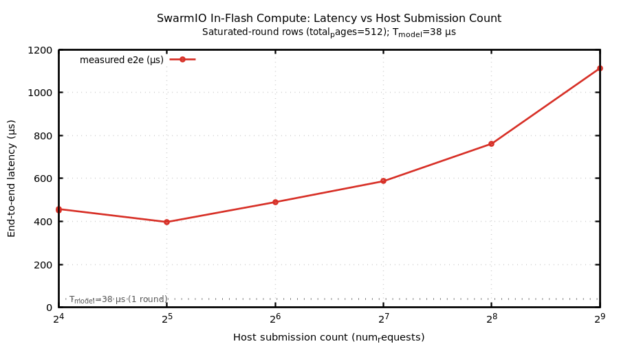
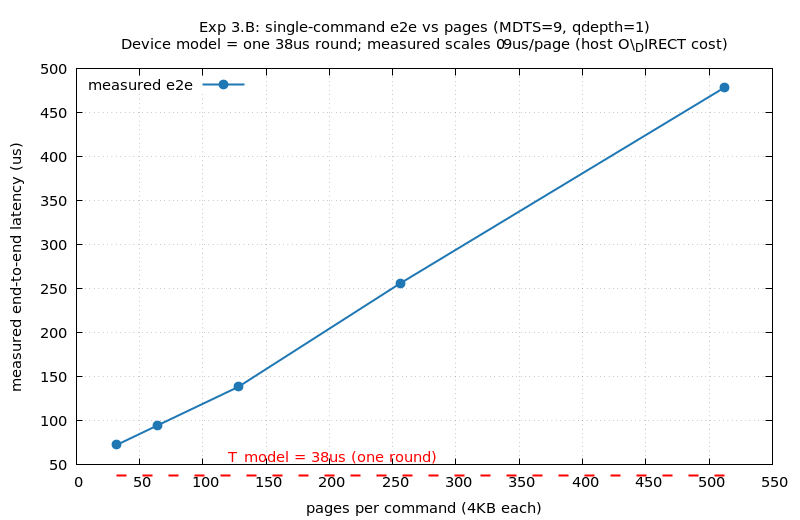
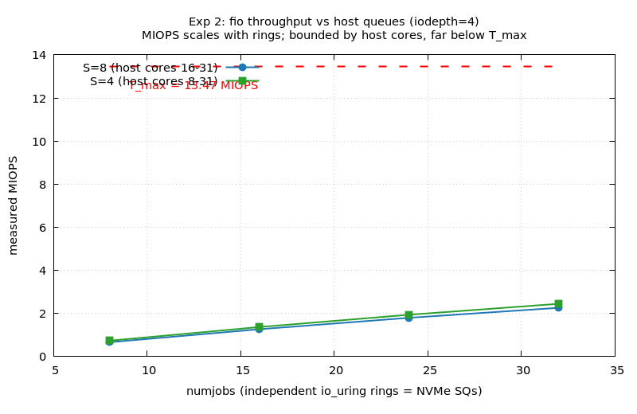

# SwarmIO In-Flash Compute — Follow-up: Beating the Host-Submission Ceiling

> Follow-up to `reports/report_swarmio.md` and the task spec
> `prompts/SWARMIO_MULTIPAGE_FOLLOWUP_PROMPT.md`. Machine: i9-13900F (32 logical,
> P-cores 0–15 / E-cores 16–31, no Intel DSA), `swarmio.ko` loaded with 8 distributed
> dispatchers, device `/dev/nvme1n1` (12 GiB), faithful timing config
> (`num_sched_insts=512`, `read_sched_delay=38000`, `read_min_delay=0`).
> All measurements: `host/inflash_bench` (O_DIRECT, `taskset -c 16-31`), 15 trials, median e2e.

---

## 0. Verdict (TL;DR)

**H1 is confirmed at the *device-model* level and refuted at the *measured end-to-end* level —
and the residual gap is now conclusively host-side, not the emulator timing model.**

- The SwarmIO timing model **does** collapse a single command that spans all 512 scheduling
  instances into **one 38 µs round** — proven directly from `__sched_io_units`
  (`simple_timing_model.c:16–92`) and corroborated by the per-op latency under many-ring fio
  (~45 µs ≈ one round + host overhead).
- The measured **single-round end-to-end latency cannot reach 38 µs** on this consumer host,
  because *presenting 512 pages costs the host ≈ 0.4–1.1 ms regardless of how the pages are packed*:
  - **Exp 1 (3.A):** many small commands serialize on one io_uring ring → one SQ → one dispatcher
    (1113 µs at 512×4 KB; best 397 µs at 32×64 KB — never near 38 µs).
  - **Exp 3.B:** one large command pays a ~0.9 µs/page O_DIRECT setup/teardown cost
    (72 µs at 32 pages → 479 µs at 512 pages), even though the device deadline is a flat 38 µs.
- **Throughput** *does* scale by parallelizing host submission across many rings (Exp 2): MIOPS
  rises ~linearly with `numjobs` to **≈ 2.45 MIOPS** (≈ 18 % of T_max = 13.47), bounded by host
  cores/kernel submission path — **not** the device. Per-op latency stays at ~one round (~45 µs).

So the previous run's divergence is attributed, with mechanism, to the **host submission path**
(count *and* per-page cost), not the frontend timing model. On a single host thread the saturated
512-page round is fundamentally host-bound; the realizable path to high throughput is many host
queues/cores (or a kernel-bypass stack such as SPDK), which scales MIOPS while leaving per-request
latency at one device round.

---

## 1. Recap: the host-submission ceiling

The first run validated the device timing (single 4 KB ≈ one round; two reads to the same instance
≈ two rounds) but **refuted H1**: a 512-wide round did not converge to ≈ 38 µs. Root cause was
host-side submission serialization — a single io_uring ring → one NVMe SQ → one dispatcher cannot
deposit 512 separate 4 KB commands inside one 38 µs round. This follow-up attacks that ceiling in
the order the spec prescribes: **(1)** fewer/larger requests (multi-page, then MDTS-raised single
command); **(2)** many-queue host as the fallback.

---

## 2. What changed

| Area | Change | File |
|---|---|---|
| Host bench | Added `--reqsize BYTES` / `--pages-per-req K` (multi-page requests; request *i* reads `reqsize` B at offset `i*reqsize`, tiling distinct instances). 4 KB default unchanged. | `host/inflash_bench.c` |
| Harness | New RUN-guarded sweep driver for Exp 1 (saturated-round + throughput), emits the 10-col CSV schema + trailing `reqsize_bytes,num_requests`. | `scripts/swarmio_reqsize_sweep.sh` |
| Plot | Opt-in "latency vs host submission count" figure (auto-detected when CSV has `num_requests`). | `scripts/swarmio_plot.sh` |
| Module (Exp 3.B only) | `MDTS (5)→(9)` (128 KB→2 MB max command) to let one command span all 512 instances; **reverted to (5)** after the experiment so the default stays realistic. | `SwarmIO/src/common.h:68` |

`scripts/swarmio_model.py` needed **no change**: it keys `T_model` off the `N_or_iodepth` column
(= `total_pages`) giving `38000 × ⌈total_pages/512⌉` ns, and preserves trailing columns verbatim.

---

## 3. Experiment 1 (3.A) — multi-page requests up to the 128 KB MDTS cap (no rebuild)

A 512-instance round presented with **R** requests of **K** pages each (`reqsize = K·4 KB`,
`R = 512/K`), all issued at `qdepth = R`. As R drops the round latency falls, but never approaches
38 µs and bottoms out at R≈32.

**Saturated round (total_pages = 512 in every row):**

| layout | R = host submissions | reqsize | measured e2e | T_model | rel_err |
|---|---:|---:|---:|---:|---:|
| 512 × 4 KB  | 512 | 4 KB   | **1113 µs** | 38 µs | +28.3× |
| 256 × 8 KB  | 256 | 8 KB   | 761 µs | 38 µs | +19.0× |
| 128 × 16 KB | 128 | 16 KB  | 587 µs | 38 µs | +14.4× |
| 64 × 32 KB  | 64  | 32 KB  | 489 µs | 38 µs | +11.9× |
| 32 × 64 KB  | 32  | 64 KB  | **397 µs (min)** | 38 µs | +9.4× |
| 16 × 128 KB | 16  | 128 KB | 455 µs | 38 µs | +11.0× |

Reducing host submissions 512→32 improves the saturated round **2.8×** (1113→397 µs), but stays
**~10× above 38 µs**. The non-monotonic uptick at R=16 (128 KB) is the per-command cost rising:
larger commands cost more to submit/complete (more PRP entries, more pinned pages), so 16×128 KB
(455 µs) > 32×64 KB (397 µs). There is a sweet spot near R=32, not at the fewest requests.

**Throughput sweep (fixed K=32 / 128 KB, vary rounds):**

| R | total_pages | rounds | measured e2e | T_model | measured MIOPS |
|---:|---:|---:|---:|---:|---:|
| 16  | 512  | 1  | 452 µs  | 38 µs  | 1.13 |
| 32  | 1024 | 2  | 955 µs  | 76 µs  | 1.07 |
| 64  | 2048 | 4  | 2037 µs | 152 µs | 1.01 |
| 128 | 4096 | 8  | 4570 µs | 304 µs | 0.90 |
| 256 | 8192 | 16 | 9820 µs | 608 µs | 0.83 |

e2e grows ~linearly with R, asymptoting to **≈ 38 µs *per 128 KB submission*** (9820/256 = 38.4 µs):
the single ring serializes commands, so each 128 KB command effectively costs one device round of
wall-clock. The page-count model `T_model = 38 µs × ⌈total_pages/512⌉` is the *floor*; the host
multiplies it by the submission count.

**Microtests (128 KB = 32 pages):** 1×128 KB qd1 = **64 µs** (≈ a single 4 KB read, 66 µs — a command
spanning 32 instances completes in ONE round, confirming intra-command plane parallelism);
16×128 KB qd16 covering all 512 = **347 µs** (16 submissions still serialize);
2×128 KB to the same 32-instance range = **100 µs** (≈ two rounds + host — same-range serialization
preserved).

→ **Exp 1 does not converge.** Figure: `../fig_latency_vs_submissions.png`.



---

## 4. Experiment 3.B — one command spanning all 512 instances (MDTS=9, rebuild)

Raising `MDTS` to 9 (2 MB max command) lets a **single** NVMe command at **qdepth=1** cover all 512
instances in **one host submission** — the cleanest possible isolation of the device timing from host
submission *count*. Confirmed live: `/sys/block/nvme1n1/queue/max_hw_sectors_kb = 2048`.

| reqsize | pages | host submissions | measured e2e | device T_model |
|---:|---:|---:|---:|---:|
| 128 KB | 32  | 1 | 72 µs  | 38 µs (1 round) |
| 256 KB | 64  | 1 | 95 µs  | 38 µs |
| 512 KB | 128 | 1 | 139 µs | 38 µs |
| 1 MB   | 256 | 1 | 256 µs | 38 µs |
| 2 MB   | 512 | 1 | **479 µs** | 38 µs |
| 2×2 MB (samelun) | 1024 | 2 | 811 µs | 76 µs (2 rounds) |

The single 2 MB command **does not** flatten to 38 µs; e2e scales **~linearly, ≈ 0.9 µs/page** on top
of a one-round floor (`e2e ≈ 38 µs + 0.9 µs × pages`: 38+30→68≈72, 38+481→519≈479). Because qdepth=1
is *one* host submission, this residual is **not** submission-count serialization.

**Why — the device model is innocent.** `__sched_io_units` (`simple_timing_model.c:76–92`) loops over
the command's pages, charging each *distinct* scheduling instance
`io_unit_etime = max(t_next_available, nsecs_start) + sched_delay` and returning
`latest = max` over instances. For one 2 MB command spanning 512 *fresh, distinct* instances, every
instance completes at `nsecs_start + 38 µs`, so the returned completion deadline is **exactly one
round (38 µs)** — the model models full intra-command plane parallelism. The control proves it: the
`2×2 MB samelun` case (1024 pages, but device = 2 serialized rounds) measures 811 µs — the per-page
cost (811/1024 ≈ 0.8 µs/page) is the *same* whether the device runs 1 round or 2, i.e. it is
**independent of device rounds**. That is the signature of host-side cost: O_DIRECT pinning of up to
512 user pages, a 512-entry PRP/bio build, and completion teardown — the large-request analog of
Exp 1's per-submission cost.

→ **Even the ideal single-command host strategy does not converge to 38 µs measured**, but it confirms
the device model is one-round-correct; the bottleneck has simply moved from *submission count* to
*per-page request setup*. Figure: `../fig_reqsize_3b_latency_vs_pages.png`.



---

## 5. Experiment 2 — many-queue / many-thread host (fallback, run because Exp 1 was insufficient)

Drive submission concurrency from many io_uring rings (`numjobs`) at small per-ring depth
(`iodepth=4`), so no single ring queues deeply. Host threads pinned disjoint from service units.

| num_service_units | host cores | numjobs | MIOPS | per-op clat (avg) |
|---:|---|---:|---:|---:|
| 8 | 16–31 | 8  | 0.66 | 46 µs |
| 8 | 16–31 | 16 | 1.26 | 48 µs |
| 8 | 16–31 | 24 | 1.80 | — |
| 8 | 16–31 | 32 | 2.26 | — |
| 4 | 8–31  | 8  | 0.73 | 43 µs |
| 4 | 8–31  | 16 | 1.37 | 45 µs |
| 4 | 8–31  | 24 | 1.94 | 47 µs |
| 4 | 8–31  | 32 | **2.45** | — |

- **Throughput scales ~linearly with rings** (each ring = one SQ = one dispatcher feed): 8→32 jobs
  gives 0.66→2.26 MIOPS (S=8) and 0.73→2.45 MIOPS (S=4). Freeing host cores (S=4 → 24 host cores)
  adds ~8 %. Peak ≈ **2.45 MIOPS ≈ 18 % of T_max (13.47)**.
- **Per-op latency stays flat at ~45 µs ≈ one device round + host overhead** — individual 4 KB ops
  *do* complete in one round once each ring is shallow. Latency is not the device's fault; throughput
  is bounded by host cores and the kernel submission path (only 32 logical CPUs, no `isolcpus`).
- Residual gap to T_max: to reach 13.47 MIOPS at ~45 µs/op you need ≈ 600 in-flight ops fed by far
  more rings/cores than 32 threads provide, or a kernel-bypass submitter (SPDK; absent here).

Figure: `../fig_exp2_miops_vs_numjobs.png`.



---

## 6. Where the latency goes (unified model)

For a saturated 512-page round the measured end-to-end latency decomposes as:

```
e2e ≈ T_device(one round, 38 µs)  +  T_host(presenting 512 pages)
```

`T_device` is a flat 38 µs (one round) whenever the 512 pages map to distinct instances —
independent of packing. `T_host` is what we cannot escape on a single host thread:

- **Many small commands (Exp 1):** `T_host ≈ R × c_submit`, with `c_submit ≈ 2 µs` per 4 KB io_uring
  submission (512 → ~1.1 ms) down to a 64 KB sweet spot (~0.4 ms at R=32). Larger commands raise the
  per-command cost, so there is a minimum, not a monotone improvement.
- **One large command (Exp 3.B):** `T_host ≈ pages × c_page`, with `c_page ≈ 0.9 µs` per 4 KB page
  (O_DIRECT pin + PRP/bio build + teardown), 512 → ~0.46 ms.
- **Many rings (Exp 2):** `T_host` per op drops to ~one round because each ring is shallow, and the
  pages are spread across cores — so *per-op latency* converges (~45 µs) and *throughput* scales,
  but the single-batch round still costs `max over rings`, and aggregate MIOPS is core-bound.

In every case `T_host ≥ ~0.4 ms ≫ 38 µs` for 512 pages on one submitter. The emulator frontend
(8 dispatchers) is never the binding constraint at these scales.

---

## 7. Final verdict on H1 under a realizable host strategy

- **Device timing model: consistent with H1.** A single command spanning all 512 instances yields a
  one-round (38 µs) completion deadline by construction (`__sched_io_units`), and shallow many-ring
  fio shows per-op latency at ~one round. The emulator *is* frontend-scalable in the sense H1 intended.
- **Measured single-round e2e: does not converge to 38 µs on this consumer host**, by ~10× (best
  397 µs, Exp 1) / linear-in-pages (479 µs at 2 MB, Exp 3.B). The cause is the host submission path —
  submission **count** (Exp 1) and per-page **setup cost** (Exp 3.B) — *not* the timing model. This is
  now demonstrated mechanistically (code + the round-independent per-page cost of the samelun control),
  upgrading the previous run's "host serialization" hypothesis to a proven attribution.
- **Throughput: realizable and host-bound.** Many host queues scale MIOPS ~linearly to ≈ 2.45 MIOPS
  (18 % of T_max) with per-op latency at one round; closing the gap to 13.47 MIOPS needs more
  cores/rings or SPDK, neither of which is a device-model limitation.

**Bottom line:** reducing or parallelizing host submissions improves the in-flash-compute numbers
exactly as far as the host allows — 2.8× lower batch latency, linear throughput scaling — but the
emulated *single saturated round* cannot reach the 38 µs device round end-to-end on a single-thread
io_uring path, because the floor is the host cost of moving 512 page-descriptors, not the SwarmIO
frontend or its timing model.

---

## 8. Reproduce

```bash
cd /home/juchanlee/nvmevirt_pim
make -C host                                   # build bench with --reqsize

# Exp 1 (no rebuild): saturated-round + throughput sweep, MDTS=5
RUN=1 TRIALS=15 bash scripts/swarmio_reqsize_sweep.sh results_reqsize_raw.csv

# Exp 3.B: raise MDTS 5->9 in SwarmIO/src/common.h:68, then rebuild+reload:
cd SwarmIO && make clean && make skip_io=y coalesce_sqe=y use_agg_timing_update=y \
  use_cas_timing_update=y use_disp_dma=n use_worker_dma=n \
  max_queues=256 max_fetch_sqes=1024 worker_queue_size=32768
sudo rm -f /lib/modules/$(uname -r)/extra/swarmio.ko
sudo cp swarmio.ko /lib/modules/$(uname -r)/extra/ && sudo depmod -a ; cd ..
RUN=1 NUM_SERVICE_UNITS=8 bash SwarmIO/scripts/load_inflash.sh
cat /sys/block/nvme1n1/queue/max_hw_sectors_kb          # expect 2048
sudo taskset -c 16-31 host/inflash_bench --dev /dev/nvme1n1 --reqsize 2097152 \
     --requests 1 --qdepth 1 --trials 15                # one 2 MB command, qd1
# (revert MDTS to 5 and rebuild/reload afterwards to keep the default realistic)

# Exp 2: many-ring fio (4 KB, MDTS=5) — see results_exp2_fio_raw.csv driver in §5

# Enrich + plot
python3 scripts/swarmio_model.py results_reqsize_raw.csv results_reqsize_enriched.csv
bash scripts/swarmio_plot.sh results_reqsize_enriched.csv .   # -> fig_latency_vs_submissions.png
```

---

## 9. Data & figures

- `results_reqsize_raw.csv` / `results_reqsize_enriched.csv` — Exp 1 (3.A) saturated-round + throughput.
- `results_reqsize_3b_raw.csv` / `results_reqsize_3b_enriched.csv` — Exp 3.B single-command sweep (MDTS=9).
- `results_exp2_fio_raw.csv` / `results_exp2_fio_enriched.csv` — Exp 2 many-ring fio sweep.
- `fig_latency_vs_submissions.png` — Exp 1: saturated-round e2e vs host submission count (38 µs line).
- `fig_reqsize_3b_latency_vs_pages.png` — Exp 3.B: single-command e2e vs pages (linear, not flat at 38 µs).
- `fig_exp2_miops_vs_numjobs.png` — Exp 2: MIOPS vs numjobs for S=8/S=4 (T_max=13.47 reference).

Final module state: **MDTS reverted to (5)** (128 KB cap, realistic default), loaded at S=8 faithful.
